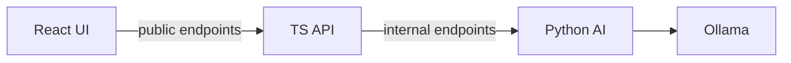
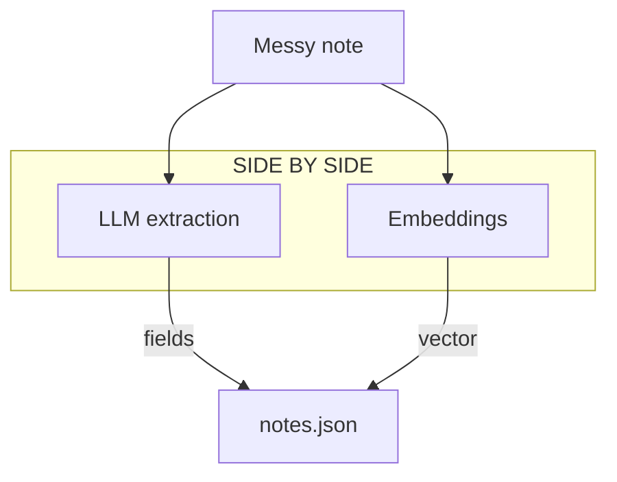
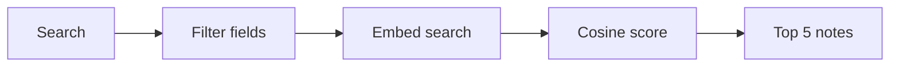

```mermaid
flowchart LR
    UI["React UI"]
    API["TS API"]
    AI["Python AI"]
    OL["Ollama"]

    UI -->|public endpoints| API
    API -->|internal endpoints| AI
    AI --> OL
```

```mermaid
flowchart TB
    N["Messy note"]

    subgraph BOTH["SIDE BY SIDE"]
        E["LLM extraction"]
        V["Embeddings"]
    end

    S["notes.json"]

    N --> E
    N --> V
    E -->|fields| S
    V -->|vector| S
```

```mermaid
flowchart LR
    Q["Search"]
    F["Filter fields"]
    V["Embed search"]
    C["Cosine score"]
    T["Top 5 notes"]

    Q --> F
    F --> V
    V --> C
    C --> T
```
