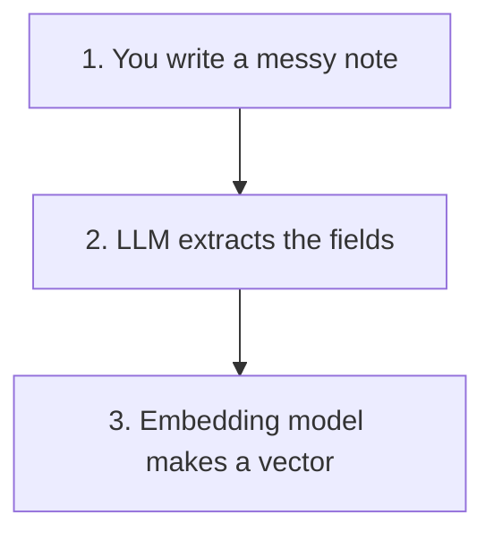
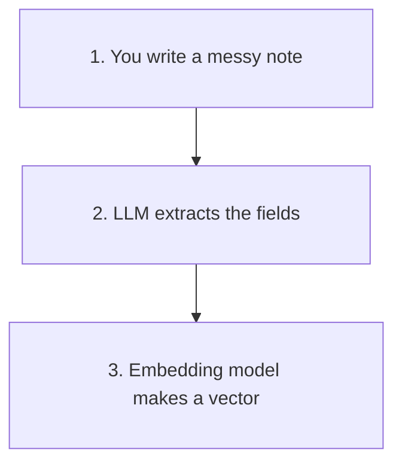

# Diagram test

## A: default

```mermaid
flowchart TD
    A["1. You write a messy note"] --> B["2. LLM extracts the fields"]
    B --> C["3. Embedding model makes a vector"]
```

## B: SVG text labels

```mermaid
%%{init: {"flowchart": {"htmlLabels": false}} }%%
flowchart TD
    A["1. You write a messy note"] --> B["2. LLM extracts the fields"]
    B --> C["3. Embedding model makes a vector"]
```

## C: SVG text labels + Arial + padding

```mermaid
%%{init: {"themeVariables": {"fontFamily": "Arial"}, "flowchart": {"htmlLabels": false, "padding": 30}} }%%
flowchart TD
    A["1. You write a messy note"] --> B["2. LLM extracts the fields"]
    B --> C["3. Embedding model makes a vector"]
```

## D: Markdown string labels

```mermaid
flowchart TD
    A["`1. You write a messy note`"] --> B["`2. LLM extracts the fields`"]
    B --> C["`3. Embedding model makes a vector`"]
```
